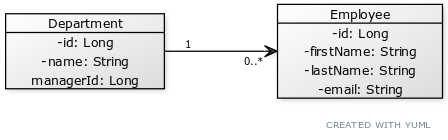

# legacy-erp

**Legacy ERP** is a simple Java project for learning and practicing purposes. 
There has been used some legacy technologies like Spring MVC, the Thousand Islands architecture
pattern and Thymeleaf instead of any regular frontend framework.

## Technologies

* Java 11
* Gradle
* Spring Boot, MVC, JPA
* Hibernate
* H2 database
* Thymeleaf
* JUnit 5

## Documentation

There are two main classes, which are database entities. Employees can be aggregated in departments, 
which has unique departments name and managersId. It is a simple relation one-to-many, where one 
department has many employees (but of course can have no employees at all).

For easy start there is a population option on the main page, which populate application with random
employees. 

## Local run :

To run this application locally just type 

`sh gradlew bootRun` - when using Linux

`./gradlew.bat bootRun` - when using Windows

in the application main directory

Application will start using default http port - `localhost:8080`

## Code coverage

In this project I have been used the JaCoCo plugin, with following parameters :
* Instructions cover ration : 90%
* Lines cover ration : 90%
* Methods cover ration : 90%
* Classes cover ration : 90%

## Roadmap

#### TODO :

`nothing`

#### IN PROGRESS :

`nothing`

#### DONE :
* ~~Add validation handling for creating employee~~
* ~~Add validation handling for updating employee~~
* ~~Add Data Population Service~~
* ~~Add Departments and Managers~~
* ~~Add department assignment option for employee update operation~~
* ~~Add update and delete department controllers~~
* ~~Create department view, with number of employees~~
* ~~Fix deleting employees assigned to department~~
* ~~Add and configure JaCoCo plugin~~
* ~~Add department info to employee view~~
* ~~Employee should be manager in only one department - fix~~
* ~~Add custom templates for errors~~
* ~~Change manager id text inputs for select option list~~
* ~~Assert unique department name~~
* ~~Add statistics on main page~~
* ~~Add restore defaults controller~~
* ~~Add pagination to lists (e.g. employees list)~~
* ~~Remove CircleCI~~
* ~~Improve app view style~~
* ~~Add about app info~~
* ~~Add right content section~~
* ~~Add employee and department model documentation~~